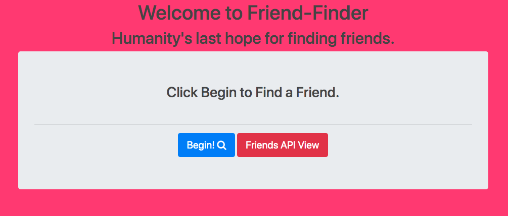

# Welcome to the friend-finder App
The friend finder app was a project built as part of the University of Denver's coding bootcamp.  
# Description
Node/Express App
# How To Use 
To access the app, simply go to https://friend-finder801.herokuapp.com/
- Click "Begin" to take a quick survey.  Once the survey is completed, the app will find the person whose answers most closely match yours and display that user to you.
- The 'api view' is also available as a demo of a functional api.
# Screenshots

# Technologies Used
- Node 
- Express
- Bootstrap
- Path
- Heroku
- MVC Architecture
